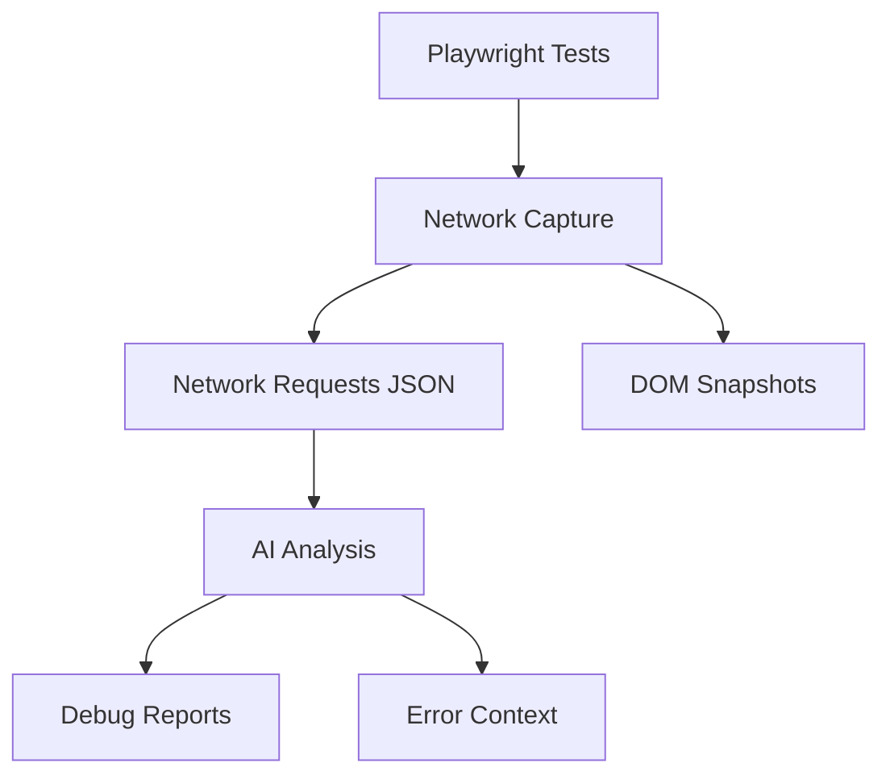

# Playwright Vision AI Context Priming Document

## Project Overview


## Core Components

### 1. Test Execution
- Entrypoint: `my-feature.spec.ts`: Main test file where Playwright tests are defined and executed.
- Configuration: `playwright.config.ts`: Configures Playwright settings, including reporters, browsers, and test directories.
- Test Output: `test-results/`: Directory where Playwright test results and artifacts are stored.

### 2. Network Verification
- Capture Module: `src/modules/networkCapture.ts`: Handles capturing network requests during test execution.
- Data Storage:
  - Raw JSON: `network-verification/network-requests.json`: Stores raw network request data in JSON format.
  - HTML Snapshots: `network-verification/network-data.html`: Stores HTML snapshots related to network activity.
- Analysis Script: `verify-network-capture.mjs`: Script used for analyzing captured network data.

### 3. AI Integration
- Core Processor: `src/modules/aiCaller.ts`: Manages communication with the AI model for debugging analysis.
- Context Gathering: `src/modules/contextGatherer.ts`: Collects relevant context (HTML, screenshot, error, etc.) for AI analysis.
- Debug Output: `test-output/ai-debug-analysis.html`: HTML report generated by the AI analysis.

### 4. Error Handling
- Central Utilities: `errorUtils.ts`: Provides utility functions for processing and extracting information from errors.
- Error Types: `types/errorTypes.ts`: Defines custom error types used within the project.
- Recovery Flow: See `src/modules/core.ts#handleError()`: Refers to the error handling logic within the core module.

### 5. Build & Config
- Package Manifest: `package.json`: Contains project metadata, dependencies, and scripts.
- TS Configuration: `tsconfig.json`: Configures the TypeScript compiler settings.
- Environment Setup: `.env.example`: Example file for environment variables needed for the project.

## Key Relationships
1. Test → Network Capture → AI Analysis chain
2. Error propagation through `core.ts → errorUtils.ts`
3. Report generation flow: `reportGenerator.ts → test-output/`

## Common Priming Patterns
```javascript
// Typical test structure
test('AI feature validation', async ({ page }) => {
  await networkCapture.start(); // From networkCapture.ts
  // ... test actions ...
  const context = contextGatherer.collect(); // From contextGatherer.ts
  await aiCaller.analyze(context); // Main AI entrypoint
});
```

## Maintenance Notes
- Versioned packages: `playwright-vision-ai-debugger-*.tgz`
- Linting/Formatting: See `package.json` scripts
- CI/CD: Refer to `.github/` (not shown in current structure)

## MCP Servers Used

- `playwright`: Used for browser automation and interaction.
- `mcp-server-firecrawl`: Used for web scraping and data extraction.
- `time-server`: Used for time-related operations.
- `sequential-thinking`: Used for complex problem-solving and analysis.
- `google-maps`: Used for geographical data and services.
- `github`: Used for interacting with GitHub repositories.
- `filesystem`: Used for file system operations within allowed directories.
- `mcp-atlassian`: Used for interacting with Jira and Confluence.

## Cross-Reference Guide
| Question Type          | Relevant Files                          |
|------------------------|-----------------------------------------|
| Network Analysis       | networkCapture.ts, verify-network-capture.mjs |
| AI Decision Making     | aiCaller.ts, test-output/               |
| Error Investigation    | errorUtils.ts, types/errorTypes.ts      |
| Test Configuration     | playwright.config.ts, my-feature.spec.ts|